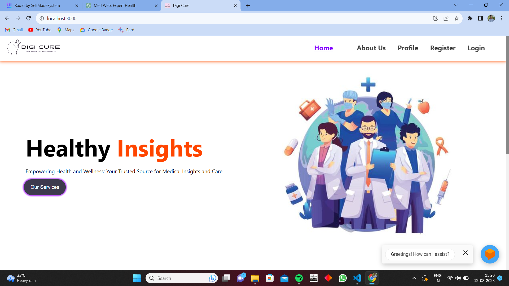
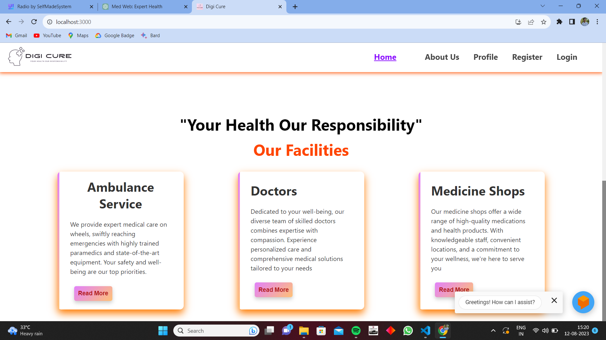

# Project Title

**README File Description:**

Welcome to Digi-Cure! This README file serves as your guide to understanding and navigating through this project. Here, you'll find essential information about the project's purpose, features, installation process, usage instructions, and more.

**Table of Contents:**

1. Introduction
2. Features
3. Installation
4. Usage
5. Configuration
6. Contributing
7. Troubleshooting
8. License

**Introduction:**
Get an overview of the project's goals, its significance, and what makes it unique. Discover how this project can benefit you and why it was created.

**Features:**
Explore the key features and functionalities that this project offers. Learn about the capabilities that set it apart and how they can address specific needs.

**Installation:**
Follow step-by-step instructions to set up the project on your local machine. Find out what tools and dependencies are required and how to ensure a smooth installation process.

**Usage:**
Learn how to use the project effectively. Find examples, code snippets, or explanations that demonstrate how to interact with the project and achieve desired outcomes.

**Configuration:**
Understand how to configure and customize the project to suit your preferences. This section might cover settings, options, or variables that can be adjusted.

**Contributing:**
Discover how you can contribute to the project. Whether it's reporting issues, suggesting improvements, or submitting code changes, find guidelines for collaboration.

**Troubleshooting:**
Encounter common issues and their solutions. Get assistance with problems you might encounter while using or developing for the project.

**License:**
Review the project's licensing information to understand how you can use, share, or modify the code. Make sure to comply with the specified terms.

Thank you for choosing Digi-Cure! We hope you find this README file helpful as you embark on your journey with this project. If you have any questions or need further assistance, please don't hesitate to reach out to our support team or community. Happy exploring!

  

 

  

