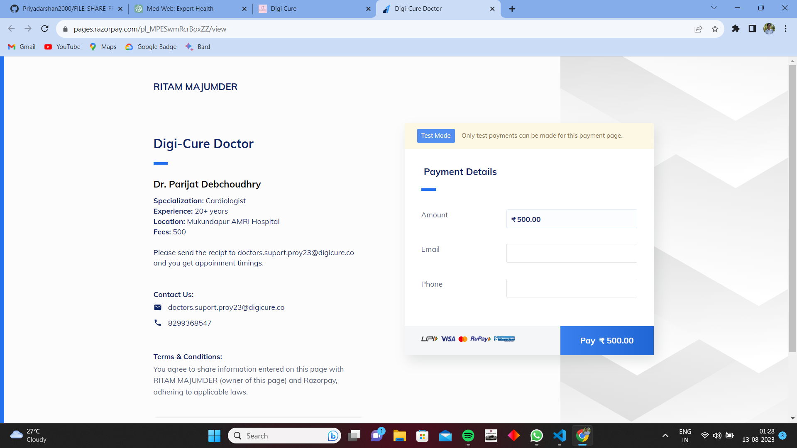
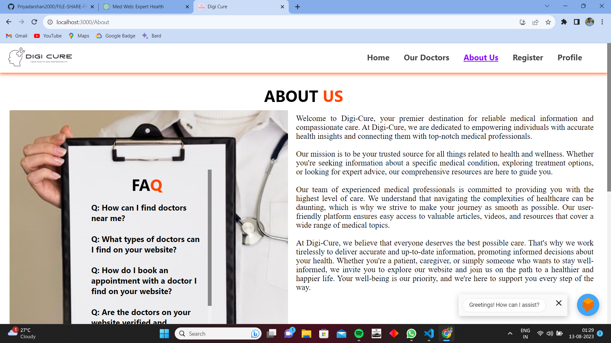
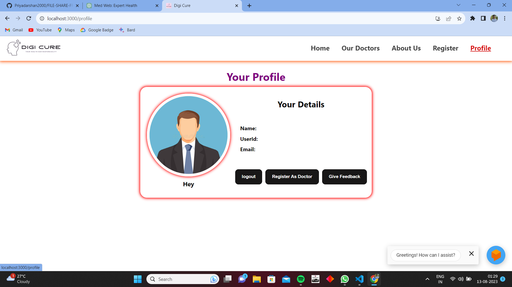

We Developed a Medical web Application using Node Js,Express JS, Mongo DB Backend And in Frontend we used React Js. We also used postman API in this Application.Our website was meticulously developed by a dedicated team of designers and programmers. From concept to code, we fused creativity and technology to bring you an intuitive and visually captivating platform. Seamlessly integrating design and functionality, we've created an engaging digital experience tailored to your needs.
How did it work?
Medical web Application has a full Stack Project.Our platform operates through a user-friendly interface, offering intuitive navigation and interactive elements. Users can effortlessly explore informative sections, access comprehensive medical insights, and seamlessly connect with healthcare professionals. Behind the scenes, robust backend systems ensure data security, while real-time updates and responsive design guarantee a smooth experience across devices. Experience the synergy of cutting-edge technology and user-centric design.

🚀 Functionalities:

1.Health Information: Access a wealth of accurate and up-to-date medical information, covering a wide spectrum of conditions, treatments, and preventive measures.

2.Find a Doctor: Effortlessly locate and connect with specialized healthcare professionals based on your preferences and location.

3.Appointment Booking: Schedule medical appointments online, manage your appointments, and receive timely reminders.

4.Feedback and Ratings: Provide and access patient reviews and ratings to make informed decisions about healthcare providers.

5.Mobile Accessibility: Seamlessly access the website and its features through responsive design on various devices.

🚀 Setup instructions

After Download or clone run, npm install OR yarn install to install all the dependencies.

Rename .env.example into .env an put all credentials.

Create a Cluster in MongoDB copy the connection string And put it into the ATLAS_URI in the .env File image

Goto sendinblue website goto SMTP & API and Copy the SMTP Server,Port,Login,Master password and put it into the SMTP_HOST,SMTP_PORT,MAIL_USER,MAIL_PASSWORD accordingly in the .env File. image

🚀 Deployment

Create a new app Connect to the Github Select the Project Choose a branch to deploy and Deploy Branch it take 2-5 min.

After Deployment is done Goto Settings->Config Vars->Reveal Config Vars add .env Variable into the Config Vars

🚀 Requirements:

Any Browser (Google Chrome,Microsoft Edge,Safari,Brave etc.)

VSCODE

MongoDB Atlas

POSTMAN

live server Extension (only for Vs code)

🚀 Medical Web Application

🚀 Home Screen

  

🚀 Doctor's_List

🚀 Doctor's_Details

🚀 Booking_page

🚀 About_us

🚀 Register_page

🚀 Myprofile_page

🚀 Demo of The FILE SHARE Application

🚀 DEVELOPER
Ritam Majunder
Soumojit Shome
Bibhab Mukhopadhyay

